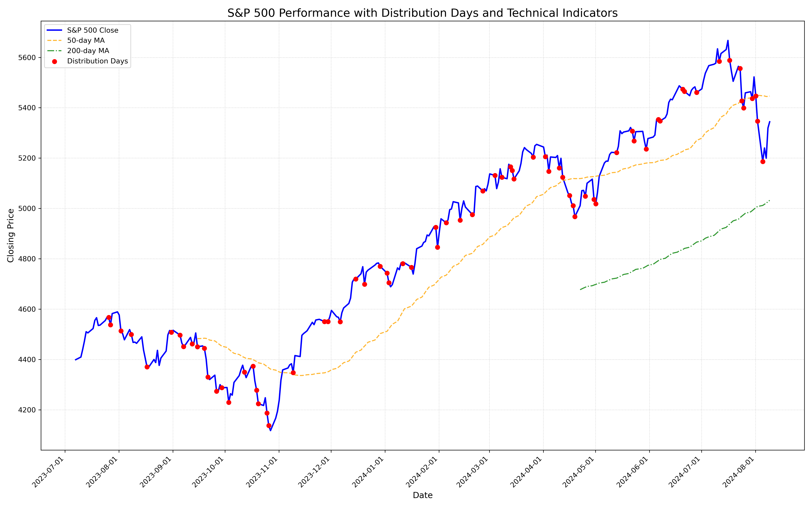

# Stock Distribution Days Analyzer with AI Insights



## Overview

The **Stock Distribution Days Analyzer** is a powerful web application that combines traditional technical analysis with cutting-edge AI to provide comprehensive market insights. Using the Investor's Business Daily (IBD) methodology enhanced with artificial intelligence, this tool helps traders and investors make more informed decisions by analyzing market conditions, identifying distribution days, and providing AI-powered market analysis.

## Key Features

- **Interactive Web Interface**: Built with Streamlit for a smooth, user-friendly experience
- **Universal Stock Analysis**: Analyze any stock or index, not just S&P 500
- **AI-Powered Market Analysis**: Get detailed AI insights including:
  - Overall market assessment
  - Technical analysis interpretation
  - Distribution days impact
  - Risk assessment
  - Key support/resistance levels
  - Trading volume analysis
  - Strategic recommendations
- **Advanced Technical Analysis**: 
  - Distribution days identification
  - Moving averages (50-day and 200-day)
  - RSI (Relative Strength Index)
  - Volume analysis
- **Interactive Visualizations**: Dynamic charts showing:
  - Price movements
  - Distribution days
  - Technical indicators
  - Volume patterns

## Getting Started

### Prerequisites

To run the script, you’ll need to have Python installed along with the following libraries:

- `yfinance`
- `pandas`
- `matplotlib`
- `ta` (for technical analysis indicators)

You can install these libraries using pip:

```bash
pip install yfinance pandas matplotlib ta
```

### Running the Script

1. Clone the repository or download the script.
   
   ```bash
   git clone https://github.com/brianlaughlin/sp500-distribution-days-analyzer.git
   ```

2. Navigate to the directory:

   ```bash
   cd sp500-distribution-days-analyzer
   ```

3. Run the script:

   ```bash
   python script_name.py
   ```

   Replace `script_name.py` with the actual name of your script file.

4. The output will include a summary of the identified distribution days, an analysis of market conditions, and a chart (`sp500_analysis.png`) visualizing the data.

## Using the Application

1. Enter any stock symbol (e.g., AAPL, MSFT, ^GSPC for S&P 500)
2. Click "Analyze" to start the analysis
3. Explore the interactive results:
   - Market Overview
   - Technical Analysis
   - Distribution Days Details
   - AI Market Analysis with actionable insights

The AI analysis provides deep insights into:
- Current market conditions and trends
- Support and resistance levels
- Volume patterns and significance
- Risk assessment and market psychology
- Strategic recommendations for traders/investors

## Features & Enhancements

Potential future enhancements to the script include:

1. **Real-Time Data Fetching**: Implement real-time data fetching for up-to-the-minute analysis.
2. **Multi-Index Analysis**: Add support for analyzing multiple indices (e.g., Nasdaq, Dow Jones).
3. **Volume-Weighted Analysis**: Incorporate volume-weighted analysis for more nuanced distribution day identification.
4. **GUI**: Develop a graphical user interface for easier user interaction and result visualization.
5. **Backtesting Capabilities**: Implement backtesting to evaluate the effectiveness of the analysis.
6. **Machine Learning**: Add machine learning models to predict future market behavior based on historical patterns.
7. **Alerts**: Implement email or SMS alerts for significant market condition changes.

## Contributing

Contributions are welcome! Please fork this repository, make your changes, and submit a pull request. Feel free to open an issue for any bug reports, feature requests, or general feedback.

## License

This project is licensed under the MIT License. See the [LICENSE](LICENSE) file for details.

## Disclaimer

This script provides a simplified version of the IBD methodology and should not be used as the sole basis for investment decisions. Always consult with a financial advisor and use multiple analysis tools when making investment decisions.

## Author

- **Brian Laughlin**

If you have any questions or feedback, feel free to reach out!
